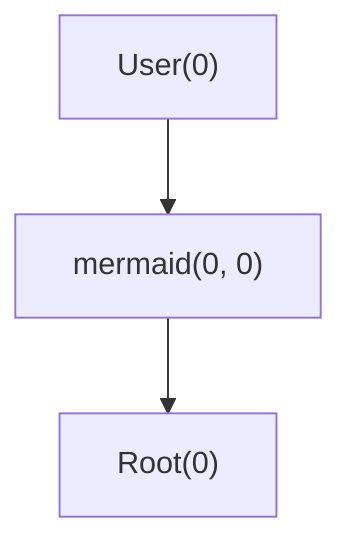

# ATG

attack graph in browser using [mermaid](https://github.com/mermaid-js/mermaid)

```
graph TD
c1["User(0)"]
c2["mermaid"]
c3["Root(0)"]
c1 --> c2 --> c3
```


```mermaid
graph TD
c1["User(0)"]
c2["mermaid(0, 0)"]
c3["Root(0)"]
c1 --> c2 --> c3
```